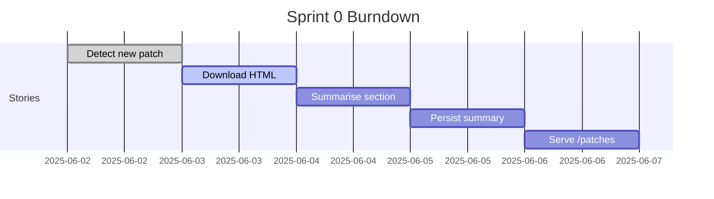

# Development Workflow

A **light‑weight GitFlow** tailored for a solo / small‑team project with full CI/CD on every push.

---

## Repository Layout (monorepo)

```text
/                 # root
├─ README.md
├─ .gitignore
├─ .env.example   # var names only, no secrets
├─ docker-compose.yaml    # local stack (postgres, minio)
├─ api/           # FastAPI backend
│   ├─ main.py
│   ├─ services/
│   ├─ models/
│   └─ tests/
├─ web/           # Next.js front‑end (app router)
│   ├─ app/
│   ├─ components/
│   └─ tests/
└─ scripts/       # one‑off CLI prototypes
```

---

## Branching & PRs

| Rule                 | Detail                                                          |
| -------------------- | --------------------------------------------------------------- |
| **Default branch**   | `main` – always deployable                                      |
| **Feature branches** | `feat/<ticket‑id>‑<slug>`                                       |
| **PR checks**        | Ruff lint, `pytest`, TypeScript `pnpm test`, Lighthouse for web |
| **Reviews**          | At least one (can be AI), squash‑merge                          |
| **Tags**             | Semantic version: `v0.1.0‑alpha`                                |

---

## Conventional Commits Cheatsheet

| Prefix      | Example                        | When                           |
| ----------- | ------------------------------ | ------------------------------ |
| `feat:`     | `feat: add /patches endpoint`  | new user‑visible functionality |
| `fix:`      | `fix: handle Cloudflare 403`   | bug fix                        |
| `chore:`    | `chore: bump Ruff 0.4`         | deps, tooling                  |
| `docs:`     | `docs: add API spec`           | README, docs only              |
| `refactor:` | `refactor: isolate summariser` | no behaviour change            |

`pnpm run cz` if install **commitizen** to guide messages.

---

## CI Pipeline (GitHub Actions)

```yaml
name: ci
on:
  pull_request:
    branches: [main]
  push:
    branches: [main]

jobs:
  build‑test:
    runs-on: ubuntu‑latest
    services:
      postgres:
        image: postgres:16
        env:
          POSTGRES_PASSWORD: postgres
        ports: ["5432:5432"]
    steps:
      - uses: actions/checkout@v4
      - uses: pnpm/action-setup@v2
        with:
          version: 9
      - uses: actions/setup-python@v5
        with:
          python-version: "3.12"
      - name: Install backend deps
        run: pip install -r api/requirements.txt
      - name: Install front‑end deps
        run: |
          cd web
          pnpm install --frozen‑lockfile
      - name: Ruff & pytest
        run: |
          ruff check api
          pytest -q api
      - name: Web tests
        run: pnpm --filter web test
      - name: Lighthouse
        uses: treosh/lighthouse-ci-action@v11
        with:
          urls: "http://localhost:3000"
          budget‑path: web/.lighthouse‑budget.json
```

---

## Pre‑commit Hooks (optional but recommended)

1. **ruff‑format** – auto‑format Python.
2. **yamllint** – catches indentation errors in GHA files.
3. **markdown‑lint** – consistent docs.
4. **commitizen** – validates Conventional Commit.

Add `.pre‑commit‑config.yaml` and run `pre‑commit install` locally.

---

## Environment & Secrets

| Env var          | Example                                | Scope         |
| ---------------- | -------------------------------------- | ------------- |
| `OPENAI_API_KEY` | sk‑\*\*\*                              | GitHub & prod |
| `DB_URL`         | postgres\://user\:pass\@db/patches     | local & prod  |
| `S3_ENDPOINT`    | [http://minio:9000](http://minio:9000) | local only    |
| `S3_ACCESS_KEY`  | minio‑admin                            | local         |
| `S3_SECRET_KEY`  | minio‑admin                            | local         |

Store production secrets in **GitHub Actions → Secrets and Variables** and mirror keys in Vercel dashboard.

---

## Dev Container (Dev Containers / Codespaces)

```jsonc
// .devcontainer/devcontainer.json
{
  "name": "lol‑patch‑app",
  "dockerComposeFile": "docker-compose.yaml",
  "service": "api",
  "extensions": [
    "ms-python.python",
    "esbenp.prettier‑vscode",
    "bierner.markdown‑preview",
    "eamodio.gitlens"
  ],
  "postCreateCommand": "pip install -r api/requirements.txt && pnpm install --filter web"
}
```

Codespaces launches pre‑wired Postgres & Minio – reduces “it works on my machine” issues.

---

## Release Flow

1. Merge PR → CI passes → tag `vX.Y.Z` → GitHub Action deploys to Vercel/Fly.
2. Draft release notes from Conventional Commits via **semantic‑release**.
3. Production smoke test runs – if fails, GitHub Action auto‑rolls back.

---

## Mermaid Burndown (template)

Paste this in README on Day 1 and update estimates in each sprint:


